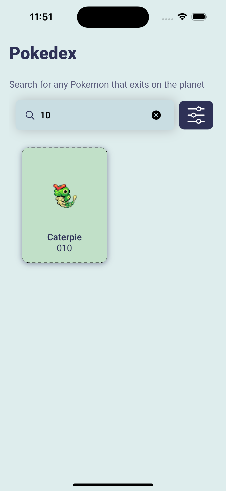

# Pokemon
The Pokemon is a Pokemon dictionary. It records data about the Pokemon’s attributes. This app will focus on the following attributes of a Pokémon: 
- Name
- Description
- Physical Attributes
- Stats
- Evolution chain
 
The Pokedex app is a simple yet powerful tool for exploring information about various Pokemon. This app has been developed using SwiftUI and follows the MVVM (Model-View-ViewModel) architecture pattern for clear separation of concerns and maintainability.

## Features

- **Pokemon List**: Explore the various Pokemon species in list, including paginations, search by name/id, filter features.
- **Pokemon Details**: View detailed information about various Pokemon, including their details, types, abilities, stats and evolution chains.

- **Evolution Chain**: Explore the evolution chain of a Pokemon, including its pre-evolved and evolved forms.

- **Type Details**: Get insights into the specific type details of a Pokemon, such as its strengths and weaknesses.
- **Pokemon Filter**: This screen has done partially.

## Technologies Used

- **SwiftUI**: The user interface is built using SwiftUI, Apple's modern declarative UI framework.

- **MVVM Architecture**: The app follows the MVVM architecture pattern, separating data (Model), UI (View), and logic (ViewModel) for maintainability and testability.
- **Firebase Integration**: The app leverages Firebase for app crashlytics, app analytics, app performance. 

- **SSL Pinning**: To enhance security, the app implements SSL pinning, ensuring that it securely communicates with the backend servers. SSL pinning guards against potential man-in-the-middle attacks.

## App Demo

[Full app recording video](https://drive.google.com/file/d/1G9omCltH92mtCsXBqYPsLIsGmlI52qef/view?usp=share_link)

## App Screenshots

| App Logo                                | Splash Screen                                |
| -------------------------------------- | ------------------------------------------- |
|  |  |

| Pokemon List                                | Pagination                                |
| -------------------------------------- | ------------------------------------------- |
|  |  |

| Search by name                                | Search by number                                |
| -------------------------------------- | ------------------------------------------- |
|  |  |

| Detail Screen                                | Stats and evolution screen                                |
| -------------------------------------- | ------------------------------------------- |
|  |  |

| Read more                                |
| -------------------------------------- |
|  |

| Filter Screen                                | Filter by gender                                |
| -------------------------------------- | ------------------------------------------- |
|  |  |

| Filter by type                                |
| -------------------------------------- |
|  |
